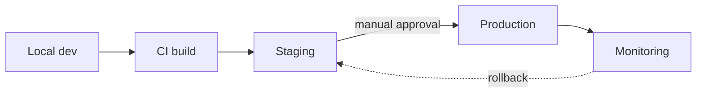

# Deployment Guide

This guide describes how a pipeline goes from a developer's laptop to
production.

## Pipeline stages



## Environments

| Environment | URL                          | Auto-deploy |
| ----------- | ---------------------------- | ----------- |
| staging     | `https://stg.acme.example`   | yes         |
| production  | `https://api.acme.example`   | no          |

## Promoting a build

1. Merge to `main` — CI builds and deploys to **staging** automatically.
2. Verify staging with `acme smoke --env staging`.
3. Approve the production deploy in the dashboard.
4. Watch the rollout:

   ```bash
   acme deploy status --env production --follow
   ```

## Rolling back

If something looks wrong:

```bash
acme deploy rollback --env production --to previous
```

> **Warning:** rollback reverts code but **not** data migrations. Check the
> migration log before rolling back.

## Checklist

- [x] CI is green
- [ ] Staging smoke tests pass
- [ ] On-call engineer is aware
- [ ] Rollback plan confirmed
